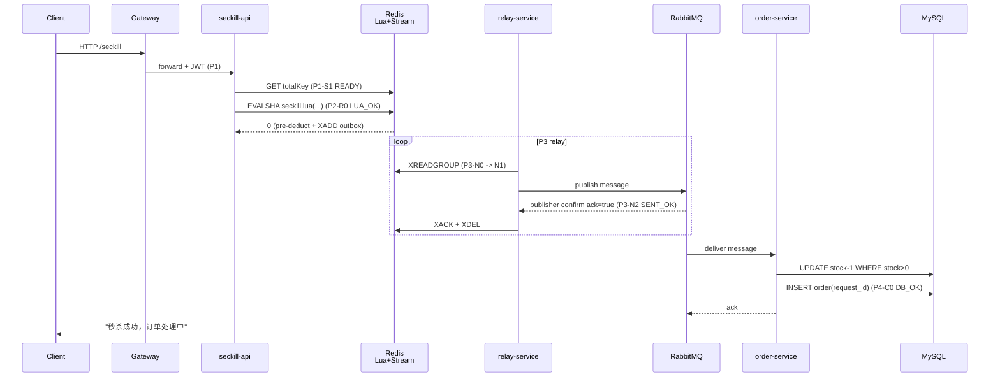

### 示意图

```mermaid
sequenceDiagram
    participant C as Client
    participant G as Gateway
    participant A as seckill-api
    participant R as Redis<br/>Lua+Stream
    participant L as relay-service
    participant MQ as RabbitMQ
    participant O as order-service
    participant DB as MySQL

    C->>G: HTTP /seckill
    G->>A: forward + JWT (P1)
    A->>R: GET totalKey (P1-S1 READY)
    A->>R: EVALSHA seckill.lua(...) (P2-R0 LUA_OK)
    R-->>A: 0 (pre-deduct + XADD outbox)

    loop P3 relay
        L->>R: XREADGROUP (P3-N0 -> N1)
        L->>MQ: publish message
        MQ-->>L: publisher confirm ack=true (P3-N2 SENT_OK)
        L->>R: XACK + XDEL
    end

    MQ->>O: deliver message
    O->>DB: UPDATE stock-1 WHERE stock>0
    O->>DB: INSERT order(request_id) (P4-C0 DB_OK)
    O-->>MQ: ack
    A-->>C: "秒杀成功，订单处理中"

```