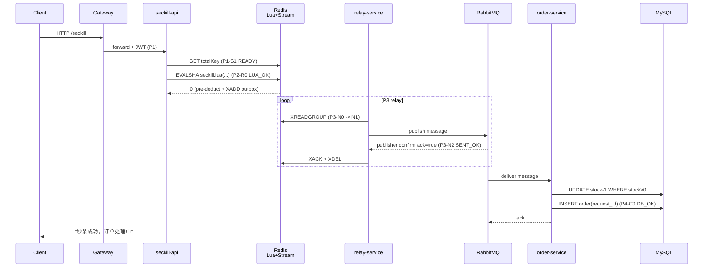
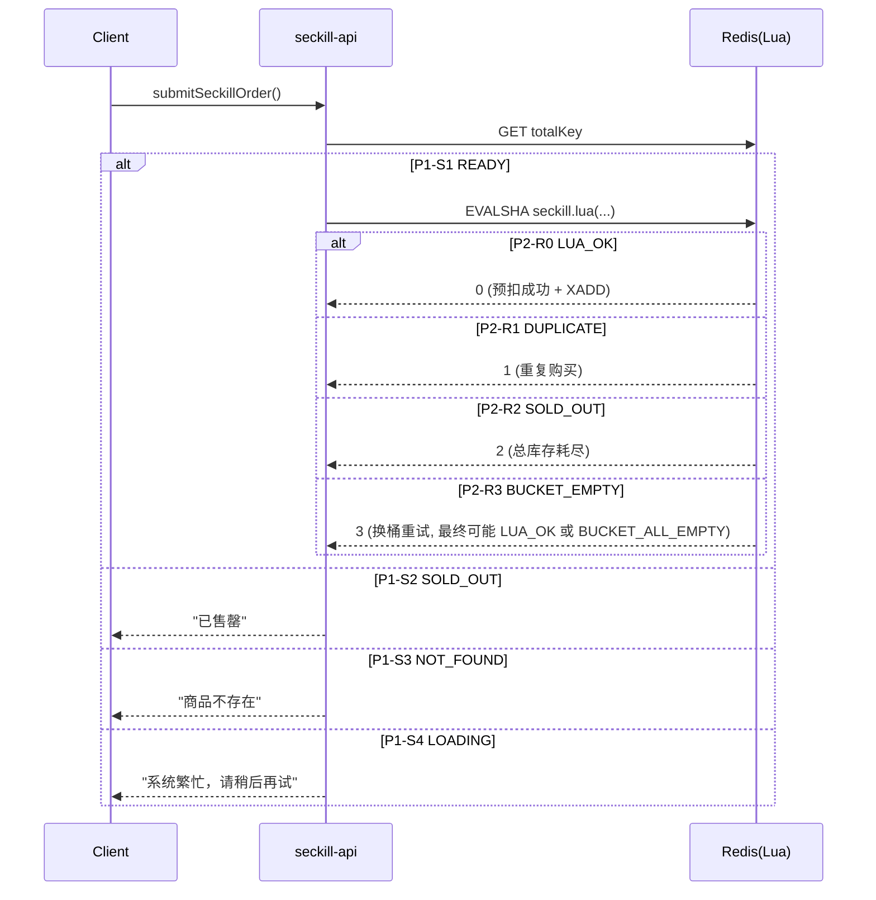
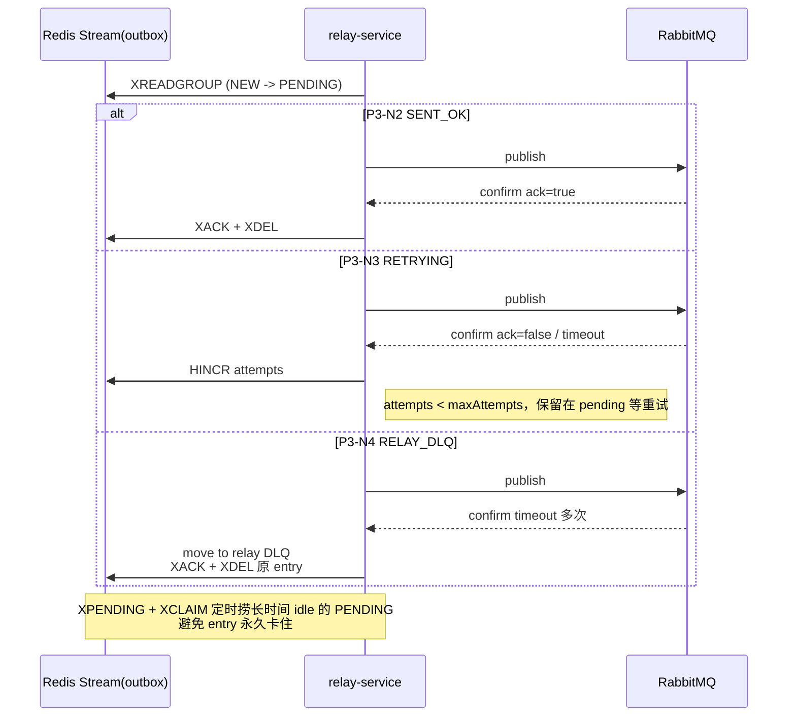
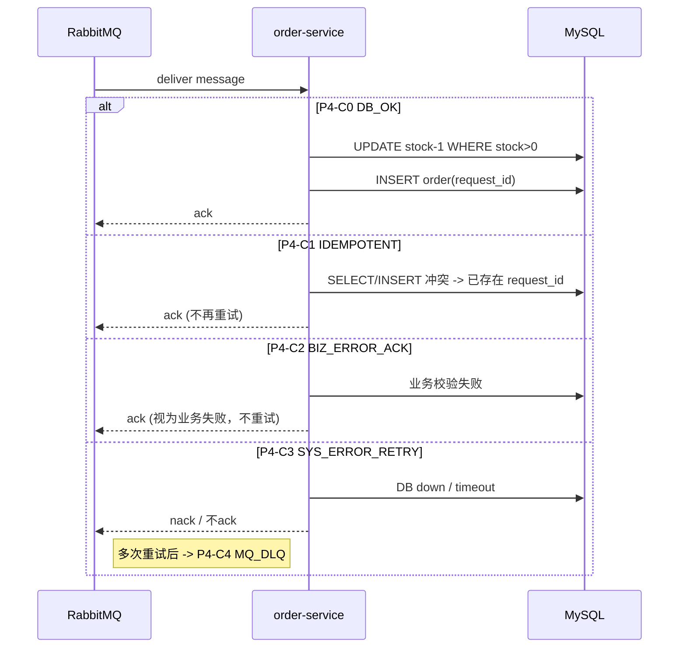
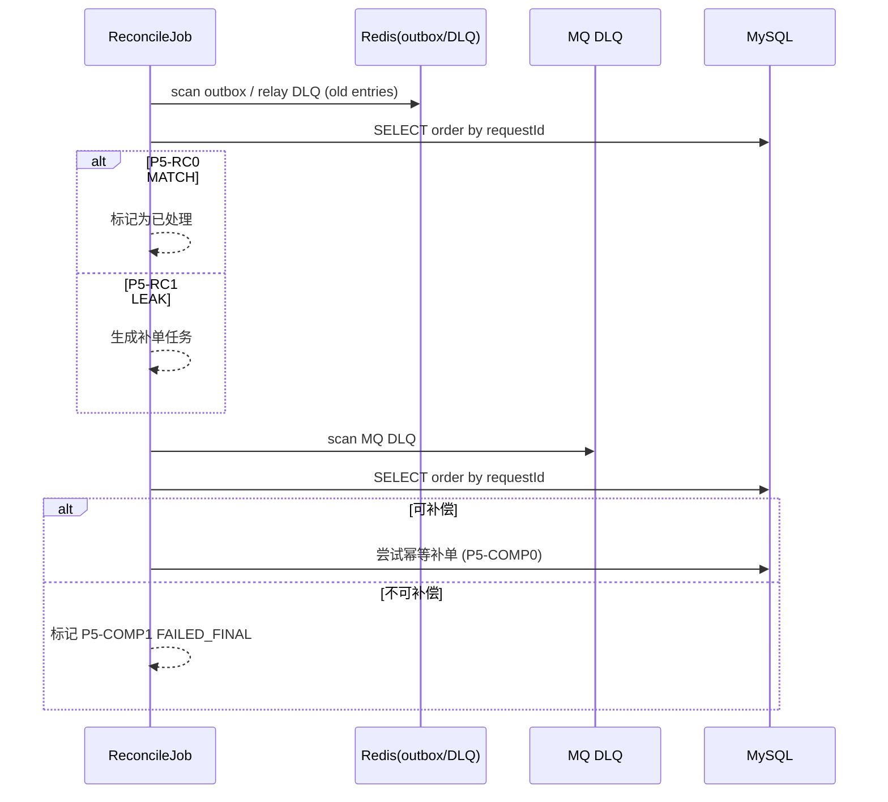

### 高层架构图
- 主要角色：
  - seckill-api：预扣库存，写入outbox；
  - Redis：库存视图 + Stream outbox；
  - relay-service：从Stream推到RabbitMQ；
  - order-service：幂等消费，写MySQL；
  - reconcile Job / DLQ 工具：事后审计、补偿
- 整体顺序图（主成功路径）：`P1-S1 READY → P2-R0 LUA_OK → P3-N2 SENT_OK → P4-C0 DB_OK → P5-RC0 MATCH`

### 阶段 + 状态建模
#### Phase 1：入口&缓存准备（P1）
- 主体：seckill-api -> Redis(Cache+Redisson 锁)
- 状态：
  - P1-S1 READY：缓存已就绪，total > 0；
  - P1-S2 SOLD_OUT：总库存 sentinel ≤ 0；
  - P1-S3 NOT_FOUND：L3 回源无商品；
  - P1-S4 LOADING：没抢到锁，别人正在回源。
#### phase 2：Lua扣库存 + outbox（P2） 
- 主体 Redis Lua
- 状态：
  - P2-R0 LUA_OK：预扣成功 + SADD user + XADD outbox
  - P2-R1 DUPLICATE：重复购买；
  - P2-R2 SOLD_OUT：总库存真实为 0；
  - P2-R3 BUCKET_EMPTY：当前桶耗尽，代码内会重试；
  - P2-R4 BUCKET_ALL_EMPTY：多桶尝试后依然失败，最终返回“桶空”。

#### phase 3：relay & MQ（P3）
- 主体：Redis Stream outbox → relay-service → RabbitMQ
- 针对一条outbox entry的状态：
  - P3-N0 NEW：刚 XADD，还没人读；
  - P3-N1 PENDING：被 XREADGROUP 读出，挂到 pending；
  - P3-N2 SENT_OK：发送 MQ + confirm ack=true → XACK+XDEL；
  - P3-N3 RETRYING：确认失败/超时，attempts < max，保留在 pending；
  - P3-N4 RELAY_DLQ：重试多次仍失败 → 写 DLQ，XACK+XDEL 原 entry。

#### phase 4：consumer & DB（P4）
- 主体：RabbitMQ -> order-service -> MySQL
- 状态：
  - P4-C0 DB_OK：扣减成功 + 插入订单；
  - P4-C1 IDEMPOTENT：已存在 requestId 或 (userId, productId)，幂等返回；
  - P4-C2 BIZ_ERROR_ACK：业务异常（库存不足、非法状态）被捕获并 ack，不再重试；
  - P4-C3 SYS_ERROR_RETRY：DB down/超时等系统异常 → 抛 RuntimeException，让 MQ 重试；
  - P4-C4 MQ_DLQ：重试次数超限，消息被 MQ 放入 DLQ。

#### phase 5：对账 & 补偿（P5）
- 主体：Reconcile Job / DLQ
- 对某个requestId的审计结果：
  - P5-RC0 MATCH：Redis/outbox/DLQ 与 DB 一致；
  - P5-RC1 LEAK：Redis/Stream/MQ 有记录，DB 无订单 → 漏单候选；
  - P5-RC2 OVER_SELL：DB 订单数 > initial_stock；
- 对某个补偿动作的结果：
  - P5-COMP0 COMPENSATED：补单成功；
  - P5-COMP1 FAILED_FINAL：补偿失败（例如真没库存），记录为永久失败。

### 测试方案
#### 验收目标
##### 不超卖
- 任意时刻DB中订单数 <= initial_stock；
- DB中stock >= 0
##### 不重复单
- 对某个requestId最多只有一条订单
##### 不默默消失
- 对所有在P2-R0（Lua_OK）状态的请求
  - 最终在DB要有订单
  - 在relay DLQ/MQ DLQ/failed_request中被记录为失败。
- 不允许存在Redis预扣，但是DB没订单，DLQ也没记录的情况
#### 测试设计
##### 总览
1. Group A：正常 + 入口逻辑（P1+P2，无故障）
    - 单用户成功、重复请求被拦截、并发下不超卖
2. Group B：relay故障路径（P3）
    - MQ短暂不可用，relay重试可成功
    - MQ长时间不可用，relay重试次数attempts达到上限，该payload进入relay DLQ
    - relay崩溃在PENDING状态，有消息在等待ack和attempts达到上限的中间状态，此时relay崩溃，靠XPENDING+XCLAIM恢复（有多个relay服务的情况，该relay挂掉，可以推给别的relay服务）
3. Group C：consumer & DB 故障路径（P4）
    - 重复投递 + 幂等
    - 业务异常不应被无限重试
    - 系统异常，MQ重试，达到次数进入MQ DLQ
    - DB崩掉后，Resilience4j发挥作用，熔断打开，不影响消息的投递行为
4. Group D：reconcile / DLQ / 补偿（P5）
    - 漏单检测、超卖检测
    - 从DLQ中回放，补单
    - 永久失败的记录与策略
5. Group E：压测 + 统计验证
    - JMeter高并发压测下的“不超卖+不重复”
    - 压测后，Redis和DB的最终一致性检测
##### Group A 无故障 + 入口逻辑
##### Group B
##### Group C
##### Group D
##### Group E
